# `crates/praxis-core/src/verify.rs`

Source SHA-256: `e31c571295c4dff497a9811c5d0ca0bdf22549728f1edf69479e7ecb422feed7`

```mermaid
classDiagram
    class struct_StageMetric {
      <<struct>>
      +"name: String"
      +"passed: bool"
      +"duration: Duration"
    }
    class struct_VerifyMetrics {
      <<struct>>
      +"stages: Vec~StageMetric~"
      +"total_duration: Duration"
      +"passed_count: usize"
      +"failed_count: usize"
    }
    class struct_VerifyGuard {
      <<struct>>
      +"stages: Vec~StageMetric~"
      +"current_stage: Option~(String"
      +"overall_start: Instant"
    }
    class struct_CheckOutcome {
      <<struct>>
      +"stage: String"
      +"passed: bool"
      +"detail: String"
    }
    class struct_Verdict {
      <<struct>>
      +"accepted: bool"
      +"profile: String"
      +"outcomes: Vec~CheckOutcome~"
      +"reason: Option~String~"
    }
    class trait_ReceiptLike {
      <<trait>>
      +"instruction_id(&self) -~ u64"
      +"ts_ns(&self) -~ u64"
      +"payload_hash_hex(&self) -~ &str"
      +"prev_chain_hash_hex(&self) -~ &str"
      +"chain_hash_hex(&self) -~ &str"
      +"prev_chain_hash(&self) -~ Result~[u8"
      +"chain_hash(&self) -~ Result~[u8"
      +"recompute_chain_hash(&self) -~ Result~[u8"
    }
    class fn_is_hex64 {
      <<fn>>
    }
    class fn_check_format {
      <<fn>>
    }
    class fn_chain_integrity {
      <<fn>>
    }
    class fn_continuity {
      <<fn>>
    }
    class fn_verify_commitments {
      <<fn>>
    }
    class fn_evaluate_profile {
      <<fn>>
    }
    class fn_run_pipeline {
      <<fn>>
    }
    class mod_tests {
      <<mod>>
    }
    note "CheckOutcome"
    note "Default for VerifyGuard"
    note "ReceiptLike for crate::receipt_record::ReceiptRecord"
    note "VerifyGuard"
    note "VerifyMetrics"
```

## Dependencies

- `crate::error::CoreError`
- `crate::receipt_record::ReceiptRecord`
- `std::time::{Duration, Instant}`
- `super::*`

## Standing

- Structural parse: `ALIVE`
- Runtime behavior: `UNKNOWN`
