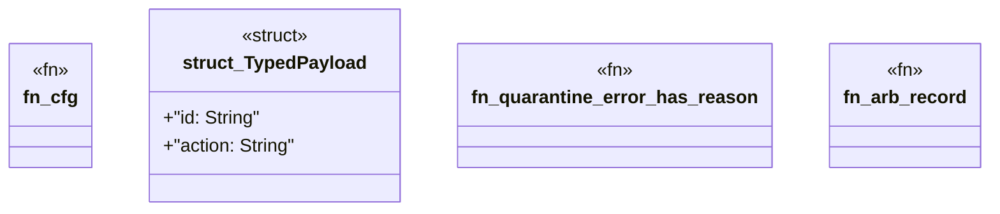

# `crates/praxis-core/tests/fuzz_boundaries.rs`

Source SHA-256: `523a2fee3106cae0b44dea49c6b60bee41345baef62ae1bc9a66ad54bc7306dd`

## Dependencies

- `praxis_core::{ law::Andon, receipt_record::{ReceiptRecord, RECEIPT_RECORD_VERSION}, receipt_validator::{FixedClock, ReceiptValidator}, JsonBoundarySchema, QuarantineError, RiceQuarantine, }`
- `proptest::prelude::*`
- `serde::{Deserialize, Serialize}`

## Standing

- Structural parse: `ALIVE`
- Runtime behavior: `UNKNOWN`
