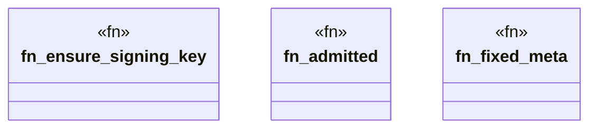

# `crates/praxis-core/tests/prop_law.rs`

Source SHA-256: `43df1e67156a6bd187889d4f7bc0f9dd5dafe6459e53613580d849615cb437fd`

## Dependencies

- `praxis_core::{ law::ReceiptMeta, lifecycle::{Admitted, Raw}, Admit, DefaultLaw, JsonBoundarySchema, Judge, LawObject, RiceQuarantine, }`
- `proptest::prelude::*`

## Standing

- Structural parse: `ALIVE`
- Runtime behavior: `UNKNOWN`
