# `crates/praxis-graphlaw/benches/bench.rs`

Source SHA-256: `42f408cec5acb2459416aeb5c356e64a75b118adbc72454cb2c59bf407422ab1`

```mermaid
classDiagram
    class fn_create_window {
      <<fn>>
    }
    class fn_add {
      <<fn>>
    }
    class fn_start_add_test {
      <<fn>>
    }
    class fn_add_100 {
      <<fn>>
    }
    class fn_add_1000 {
      <<fn>>
    }
    class fn_add_10000 {
      <<fn>>
    }
    class fn_update {
      <<fn>>
    }
    class fn_start_update_test {
      <<fn>>
    }
    class fn_update_100 {
      <<fn>>
    }
    class fn_update_1000 {
      <<fn>>
    }
    class fn_update_10000 {
      <<fn>>
    }
    class fn_test_transitive_rule {
      <<fn>>
    }
```

## Dependencies

- `bencher::Bencher`
- `praxis_graphlaw::TripleStore`
- `praxis_graphlaw::imars_window::{ImarsWindow, SimpleWindowConsumer}`
- `std::cell::RefCell`
- `std::rc::Rc`

## Standing

- Structural parse: `ALIVE`
- Runtime behavior: `UNKNOWN`
