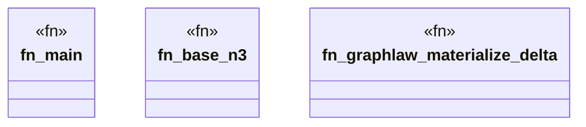

# `crates/praxis-graphlaw/benches/blue_river_dam.rs`

Source SHA-256: `ebd5d9760f7a684f30c0254f103c5702c2a559253453db0d376a5c1c67ce1ae1`

## Dependencies

- `praxis_graphlaw::TripleStore`
- `praxis_graphlaw::parser::Parser`

## Standing

- Structural parse: `ALIVE`
- Runtime behavior: `UNKNOWN`
