# `crates/praxis-graphlaw/benches/business_logic_replacement.rs`

Source SHA-256: `e5bd7e18217d4d06e61610a4e68372762e4233b82c41b61fcce7f922d9e3a8ce`

```mermaid
classDiagram
    class fn_control_flow_minimal_approval_approved_path {
      <<fn>>
    }
    class fn_control_flow_minimal_approval_refused_path {
      <<fn>>
    }
    class fn_approval_routing_single {
      <<fn>>
    }
    class fn_approval_routing_100 {
      <<fn>>
    }
    class fn_approval_routing_1000 {
      <<fn>>
    }
    class fn_state_machine_transition_single {
      <<fn>>
    }
    class fn_state_machine_transition_1k_batch {
      <<fn>>
    }
    class fn_idempotency_check {
      <<fn>>
    }
    class fn_sla_escalation_1k_tickets {
      <<fn>>
    }
    class fn_policy_conflict_refusal {
      <<fn>>
    }
```

## Dependencies

- `bencher::Bencher`
- `praxis_graphlaw::TripleStore`
- `praxis_graphlaw::parser::Syntax`
- `std::collections::HashSet`

## Standing

- Structural parse: `ALIVE`
- Runtime behavior: `UNKNOWN`
