# `crates/praxis-graphlaw/benches/daily_standing.rs`

Source SHA-256: `78431b1fcfc29eae03a3402700db51a07857c447f2d2da5aa6872680a9091c7c`

```mermaid
classDiagram
    class fn_build_hook_pack {
      <<fn>>
    }
    class fn_hook_pack_admission_small {
      <<fn>>
    }
    class fn_hook_pack_admission_medium {
      <<fn>>
    }
    class fn_event_delta_firing_small {
      <<fn>>
    }
    class fn_event_delta_firing_medium {
      <<fn>>
    }
    class fn_release_standing_validation_shacl_only {
      <<fn>>
    }
    class fn_release_standing_full_pipeline {
      <<fn>>
    }
    class fn_process_intelligence_slice {
      <<fn>>
    }
```

## Dependencies

- `bencher::Bencher`
- `praxis_graphlaw::TripleStore`
- `praxis_graphlaw::parser::Syntax`
- `praxis_graphlaw::shacl::{ShapesGraph, Validator as ShaclValidator}`

## Standing

- Structural parse: `ALIVE`
- Runtime behavior: `UNKNOWN`
