# `crates/praxis-graphlaw/benches/hierarchies.rs`

Source SHA-256: `d0f0bbf5484b6cade92c05150a7eda03429a6f9a4d92296a6d192fb0be06e1a4`

```mermaid
classDiagram
    class fn_infer_hierarchy {
      <<fn>>
    }
    class fn_infer_hierarchy_rdf_rule {
      <<fn>>
    }
    class fn_shacl_hierarchy_validate {
      <<fn>>
    }
    class fn_test_hierarchy_1000 {
      <<fn>>
    }
    class fn_test_hierarchy_100 {
      <<fn>>
    }
    class fn_test_hierarchy_10 {
      <<fn>>
    }
    class fn_test_rdf_hierarchy_50 {
      <<fn>>
    }
    class fn_test_rdf_hierarchy_100 {
      <<fn>>
    }
    class fn_test_rdf_hierarchy_10 {
      <<fn>>
    }
    class fn_test_shacl_hierarchy_1000 {
      <<fn>>
    }
    class fn_test_shacl_hierarchy_100 {
      <<fn>>
    }
    class fn_test_shacl_hierarchy_10 {
      <<fn>>
    }
```

## Dependencies

- `bencher::Bencher`
- `praxis_graphlaw::TripleStore`
- `praxis_graphlaw::parser::{Parser, Syntax}`
- `praxis_graphlaw::shacl::{ShapesGraph, Validator as ShaclValidator}`
- `praxis_graphlaw::tripleindex::TripleIndex`

## Standing

- Structural parse: `ALIVE`
- Runtime behavior: `UNKNOWN`
