# `crates/praxis-graphlaw/benches/owlrl.rs`

Source SHA-256: `4192cd2781899febd3168023dde8913783ef70ee2abdf4c4bc366ab11c313673`

```mermaid
classDiagram
    class fn_owlrl_subclass_hierarchy {
      <<fn>>
    }
    class fn_owlrl_subproperty_hierarchy {
      <<fn>>
    }
    class fn_owlrl_transitive_property_chain {
      <<fn>>
    }
    class fn_bench_owlrl_subclass_10 {
      <<fn>>
    }
    class fn_bench_owlrl_subclass_100 {
      <<fn>>
    }
    class fn_bench_owlrl_subclass_1000 {
      <<fn>>
    }
    class fn_bench_owlrl_subproperty_10 {
      <<fn>>
    }
    class fn_bench_owlrl_subproperty_100 {
      <<fn>>
    }
    class fn_bench_owlrl_subproperty_1000 {
      <<fn>>
    }
    class fn_bench_owlrl_transitive_property_10 {
      <<fn>>
    }
    class fn_bench_owlrl_transitive_property_100 {
      <<fn>>
    }
    class fn_bench_owlrl_transitive_property_1000 {
      <<fn>>
    }
```

## Dependencies

- `bencher::{benchmark_group, benchmark_main, Bencher}`
- `praxis_graphlaw::TripleStore`

## Standing

- Structural parse: `ALIVE`
- Runtime behavior: `UNKNOWN`
