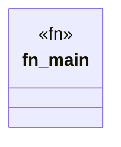

# `crates/praxis-graphlaw/run_test_debug.rs`

Source SHA-256: `9cd9b049636f6727c27669941f46e76c4be99fa9cbcec7c64bad0c71a5c7c443`

## Dependencies

- None observed.

## Standing

- Structural parse: `ALIVE`
- Runtime behavior: `UNKNOWN`
