# `crates/praxis-graphlaw/src/aggregation.rs`

Source SHA-256: `2dfae028bf22059b2572d71bb8fdff9a72941195e2f038b731067aaf67565da1`

```mermaid
classDiagram
    class fn_clean_numeric_str {
      <<fn>>
    }
    class trait_Accumulator {
      <<trait>>
      +"add(&mut self, encoded_item: usize)"
      +"get(&self) -~ usize"
    }
    class struct_CountAccumulator {
      <<struct>>
      +"count: usize"
    }
    class struct_SumAccumulator {
      <<struct>>
      +"sum: f64"
    }
    class struct_MinAccumulator {
      <<struct>>
      +"min: Option~f64~"
    }
    class struct_MaxAccumulator {
      <<struct>>
      +"max: Option~f64~"
    }
    class struct_AvgAccumulator {
      <<struct>>
      +"sum: f64"
      +"count: usize"
    }
    class enum_AccumulatorImpl {
      <<enum>>
    }
    note "Accumulator for AccumulatorImpl"
    note "Accumulator for AvgAccumulator"
    note "Accumulator for CountAccumulator"
    note "Accumulator for MaxAccumulator"
    note "Accumulator for MinAccumulator"
    note "Accumulator for SumAccumulator"
    note "Default for AvgAccumulator"
    note "Default for SumAccumulator"
```

## Dependencies

- `crate::encoding::Encoder`
- `crate::utils::Utils`

## Standing

- Structural parse: `ALIVE`
- Runtime behavior: `UNKNOWN`
