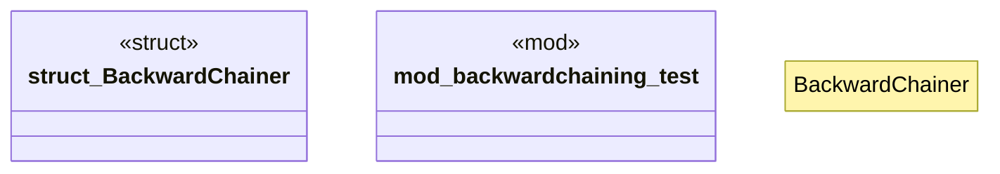

# `crates/praxis-graphlaw/src/backwardchaining.rs`

Source SHA-256: `d12a0d208358ecfa42d7787c39076ce82a1b6b87adfa198c93456bb6d591ea7e`

## Dependencies

- `crate::fastmap::{FxHashMap, FxHashSet}`
- `crate::queryengine::{QueryEngine, SimpleQueryEngine}`
- `crate::{Binding, BodyLiteral, Rule, RuleIndex, Triple, TripleIndex, TripleStore, VarOrTerm}`
- `log::{debug, warn}`
- `std::sync::Arc`

## Standing

- Structural parse: `ALIVE`
- Runtime behavior: `UNKNOWN`
