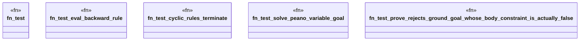

# `crates/praxis-graphlaw/src/backwardchaining_test.rs`

Source SHA-256: `ad264b7d0e227b106687d7439c341450d5344c957ba2db55ab9ee8e9aa50ccbc`

## Dependencies

- `crate::{BackwardChainer, Encoder, Syntax, Triple, TripleStore, VarOrTerm}`
- `std::collections::HashMap`

## Standing

- Structural parse: `ALIVE`
- Runtime behavior: `UNKNOWN`
