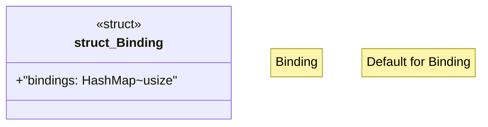

# `crates/praxis-graphlaw/src/bindings.rs`

Source SHA-256: `8e747b7ca44d2d33913bcb1f8c116aa3382a963909dbc435d1f62e55cea5711b`

## Dependencies

- `std::collections::HashMap`

## Standing

- Structural parse: `ALIVE`
- Runtime behavior: `UNKNOWN`
