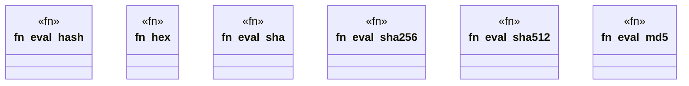

# `crates/praxis-graphlaw/src/builtins/crypto.rs`

Source SHA-256: `0934d41024962fdd45892223e256729381a245441e5e07d5a03ead98e4d06aa5`

## Dependencies

- `crate::{Binding, Triple}`
- `sha1::Digest as Sha1Digest`
- `sha2::{Sha256, Sha512}`
- `super::{eval_functional, intern_string, lexical_value, resolve_operand}`

## Standing

- Structural parse: `ALIVE`
- Runtime behavior: `UNKNOWN`
