# `crates/praxis-graphlaw/src/builtins/func.rs`

Source SHA-256: `371cf605db59cf22740b303e586ce535e1334c48cbfed198297f83bfb8233abf`

```mermaid
classDiagram
    class fn_eval_lang_from_plain_literal {
      <<fn>>
    }
    class fn_intern_boolean {
      <<fn>>
    }
    class fn_eval_numeric_binary {
      <<fn>>
    }
    class fn_eval_numeric_unary {
      <<fn>>
    }
    class fn_eval_numeric_predicate {
      <<fn>>
    }
    class fn_eval_numeric_add {
      <<fn>>
    }
    class fn_eval_numeric_subtract {
      <<fn>>
    }
    class fn_eval_numeric_multiply {
      <<fn>>
    }
    class fn_eval_numeric_divide {
      <<fn>>
    }
    class fn_eval_numeric_integer_divide {
      <<fn>>
    }
    class fn_eval_numeric_mod {
      <<fn>>
    }
    class fn_eval_numeric_abs {
      <<fn>>
    }
    class fn_eval_numeric_negate {
      <<fn>>
    }
    class fn_eval_numeric_equal {
      <<fn>>
    }
    class fn_eval_numeric_less_than {
      <<fn>>
    }
    class fn_eval_numeric_greater_than {
      <<fn>>
    }
    class fn_eval_string_length {
      <<fn>>
    }
    class fn_eval_substring {
      <<fn>>
    }
```

## Dependencies

- `crate::{Binding, Triple, VarOrTerm}`
- `super::{ eval_functional, intern_number, intern_string, lang_value, lexical_value, numeric_value, subject_list_members, }`

## Standing

- Structural parse: `ALIVE`
- Runtime behavior: `UNKNOWN`
