# `crates/praxis-graphlaw/src/builtins/list.rs`

Source SHA-256: `554750f42cb5dbd830e4b2108efe026fad97c22c43528939b816f35cd0e15094`

```mermaid
classDiagram
    class fn_eval_list_length {
      <<fn>>
    }
    class fn_eval_list_in {
      <<fn>>
    }
    class fn_eval_list_append {
      <<fn>>
    }
    class fn_ids_to_list {
      <<fn>>
    }
    class fn_eval_list_first {
      <<fn>>
    }
    class fn_eval_list_rest {
      <<fn>>
    }
    class fn_eval_list_last {
      <<fn>>
    }
    class fn_eval_list_member {
      <<fn>>
    }
    class fn_eval_list_not_member {
      <<fn>>
    }
    class fn_eval_list_first_rest {
      <<fn>>
    }
    class fn_eval_list_member_at {
      <<fn>>
    }
    class fn_eval_list_remove {
      <<fn>>
    }
    class fn_eval_list_sort {
      <<fn>>
    }
    class fn_eval_list_unique {
      <<fn>>
    }
    class fn_eval_list_reverse {
      <<fn>>
    }
    class fn_eval_list_iterate {
      <<fn>>
    }
```

## Dependencies

- `crate::{Binding, Triple, VarOrTerm}`
- `super::{ copy_row, eval_functional, eval_generator, intern_number, resolve_operand, subject_list_members, }`

## Standing

- Structural parse: `ALIVE`
- Runtime behavior: `UNKNOWN`
