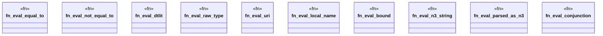

# `crates/praxis-graphlaw/src/builtins/log.rs`

Source SHA-256: `ecb67dbf6e1aeae48bc7ee289ccb75a0d9733f36863e8f843850121a71c24c07`

## Dependencies

- `crate::{Binding, Encoder, Term, Triple, VarOrTerm}`
- `super::{ eval_functional, eval_row_constraint, intern_string, lexical_value, numeric_value, resolve_operand, subject_list_members, }`

## Standing

- Structural parse: `ALIVE`
- Runtime behavior: `UNKNOWN`
