# `crates/praxis-graphlaw/src/builtins/math.rs`

Source SHA-256: `7813bde5c57b506424abaa246cd953af780e123b02f59f937d937879dd1501bb`

```mermaid
classDiagram
    class fn_eval_greater_than {
      <<fn>>
    }
    class fn_eval_not_less_than {
      <<fn>>
    }
    class fn_eval_not_greater_than {
      <<fn>>
    }
    class fn_eval_less_than {
      <<fn>>
    }
    class fn_eval_math_equal_to {
      <<fn>>
    }
    class fn_eval_math_not_equal_to {
      <<fn>>
    }
    class fn_eval_sum {
      <<fn>>
    }
    class fn_eval_difference {
      <<fn>>
    }
    class fn_eval_product {
      <<fn>>
    }
    class fn_eval_quotient {
      <<fn>>
    }
    class fn_eval_remainder {
      <<fn>>
    }
    class fn_subject_number {
      <<fn>>
    }
    class fn_eval_unary {
      <<fn>>
    }
    class fn_eval_absolute_value {
      <<fn>>
    }
    class fn_eval_negation {
      <<fn>>
    }
    class fn_eval_rounded {
      <<fn>>
    }
    class fn_eval_ceiling {
      <<fn>>
    }
    class fn_eval_floor {
      <<fn>>
    }
    class fn_eval_sin {
      <<fn>>
    }
    class fn_eval_cos {
      <<fn>>
    }
    class fn_eval_tan {
      <<fn>>
    }
    class fn_eval_asin {
      <<fn>>
    }
    class fn_eval_acos {
      <<fn>>
    }
    class fn_eval_atan {
      <<fn>>
    }
    class fn_eval_exponentiation {
      <<fn>>
    }
    class fn_eval_integer_quotient {
      <<fn>>
    }
    class fn_eval_min {
      <<fn>>
    }
    class fn_eval_max {
      <<fn>>
    }
    class fn_eval_atan2 {
      <<fn>>
    }
    class fn_eval_logarithm {
      <<fn>>
    }
    class fn_eval_member_count {
      <<fn>>
    }
```

## Dependencies

- `crate::{Binding, Triple}`
- `super::{ eval_functional, eval_row_constraint, intern_number, numeric_value, resolve_operand, subject_list_members, }`

## Standing

- Structural parse: `ALIVE`
- Runtime behavior: `UNKNOWN`
