# `crates/praxis-graphlaw/src/builtins/mod.rs`

Source SHA-256: `d7efc1ef2fcd032cf7a8e9e1e7f4aa3c0ed2e1737dee480a231610a637171cef`

```mermaid
classDiagram
    class mod_crypto {
      <<mod>>
    }
    class mod_func {
      <<mod>>
    }
    class mod_list {
      <<mod>>
    }
    class mod_log {
      <<mod>>
    }
    class mod_math {
      <<mod>>
    }
    class mod_string {
      <<mod>>
    }
    class mod_time {
      <<mod>>
    }
    class mod_builtins_test {
      <<mod>>
    }
    class enum_BuiltinKind {
      <<enum>>
    }
    class fn_reject_if_unsupported_builtin {
      <<fn>>
    }
    class fn_classify {
      <<fn>>
    }
    class fn_evaluate {
      <<fn>>
    }
    class fn_resolve_operand {
      <<fn>>
    }
    class fn_subject_list_members {
      <<fn>>
    }
    class fn_numeric_value {
      <<fn>>
    }
    class fn_lexical_value {
      <<fn>>
    }
    class fn_lang_value {
      <<fn>>
    }
    class fn_intern_number {
      <<fn>>
    }
    class fn_intern_string {
      <<fn>>
    }
    class fn_copy_row {
      <<fn>>
    }
    class fn_eval_row_constraint {
      <<fn>>
    }
    class fn_eval_functional {
      <<fn>>
    }
    class fn_eval_generator {
      <<fn>>
    }
```

## Dependencies

- `crate::{Binding, Encoder, Term, Triple, VarOrTerm}`

## Standing

- Structural parse: `ALIVE`
- Runtime behavior: `UNKNOWN`
