# `crates/praxis-graphlaw/src/builtins/string.rs`

Source SHA-256: `6973a9ed82c7c043779ef95f96acfd5578fc68187ae7fd63ada3580d646f852c`

```mermaid
classDiagram
    class fn_eval_string_length {
      <<fn>>
    }
    class fn_eval_string_concat {
      <<fn>>
    }
    class fn_eval_string_less_than {
      <<fn>>
    }
    class fn_eval_string_greater_than {
      <<fn>>
    }
    class fn_eval_string_contains {
      <<fn>>
    }
    class fn_eval_string_contains_ignoring_case {
      <<fn>>
    }
    class fn_eval_string_starts_with {
      <<fn>>
    }
    class fn_eval_string_ends_with {
      <<fn>>
    }
    class fn_eval_string_equal_ignoring_case {
      <<fn>>
    }
    class fn_eval_string_not_equal_ignoring_case {
      <<fn>>
    }
    class fn_eval_string_matches {
      <<fn>>
    }
    class fn_eval_string_not_matches {
      <<fn>>
    }
    class fn_eval_string_to_upper_case {
      <<fn>>
    }
    class fn_eval_string_to_lower_case {
      <<fn>>
    }
    class fn_eval_string_replace {
      <<fn>>
    }
    class fn_eval_string_substring {
      <<fn>>
    }
    class fn_eval_string_split {
      <<fn>>
    }
    class fn_eval_string_format {
      <<fn>>
    }
    class fn_eval_string_scrape {
      <<fn>>
    }
```

## Dependencies

- `crate::{Binding, Triple, VarOrTerm}`
- `regex::Regex`
- `super::{ eval_functional, eval_row_constraint, intern_number, intern_string, lexical_value, resolve_operand, subject_list_members, }`

## Standing

- Structural parse: `ALIVE`
- Runtime behavior: `UNKNOWN`
