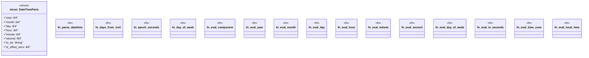

# `crates/praxis-graphlaw/src/builtins/time.rs`

Source SHA-256: `008be9cd8ac4c8b10d4ea3011ebe866d866329301d1879297505691a8717e700`

## Dependencies

- `crate::{Binding, Triple}`
- `super::{eval_functional, intern_number, intern_string, lexical_value, resolve_operand}`

## Standing

- Structural parse: `ALIVE`
- Runtime behavior: `UNKNOWN`
