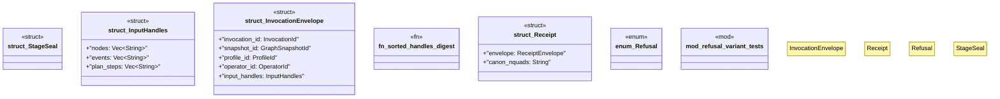

# `crates/praxis-graphlaw/src/chatman/abi.rs`

Source SHA-256: `3eff06e7df948271b0f920216a5cfd651bd869fca173bb0c2530232198c4b171`

## Dependencies

- `serde::{Deserialize, Serialize}`
- `wasm4pm_compat::hash::{blake3_combined, blake3_hex}`
- `wasm4pm_compat::receipt::Digest`
- `wasm4pm_compat::receipt::{ReceiptEnvelope, ReplayHint}`

## Standing

- Structural parse: `ALIVE`
- Runtime behavior: `UNKNOWN`
