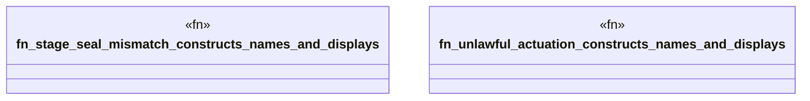

# `crates/praxis-graphlaw/src/chatman/abi_test.rs`

Source SHA-256: `32e834612acad8ea2cfc8c1a12465389deb230e4c13da7b2067faba6b1f9a2de`

## Dependencies

- `super::Refusal`

## Standing

- Structural parse: `ALIVE`
- Runtime behavior: `UNKNOWN`
