# `crates/praxis-graphlaw/src/chatman/admission8.rs`

Source SHA-256: `99098dd304d43b170bd742fcfe9ddcebda2c12628a69e78b25d5e047fe081374`

```mermaid
classDiagram
    class struct_Law8 {
      <<struct>>
    }
    class struct_ConstraintMask {
      <<struct>>
    }
    class struct_Admission8 {
      <<struct>>
      +"admit: bool"
      +"next_state_or: u8"
      +"next_state_and: u8"
    }
    class struct_ConstraintBinding {
      <<struct>>
      +"predicate: P"
      +"bit: u8"
    }
    class trait_PredicateBearer {
      <<trait>>
      +"predicate(&self) -~ &Self::Predicate"
    }
    class fn_state_mask {
      <<fn>>
    }
    class struct_AdmissionTable8 {
      <<struct>>
      +"entries: Box~[Admission8; 256]~"
      +"hash: String"
      +"constraint_names: Vec~String~"
      +"_law: Law8"
    }
    class fn_table_hash {
      <<fn>>
    }
    class mod_tests {
      <<mod>>
    }
    note "AdmissionTable8"
    note "Clone for AdmissionTable8"
    note "core::fmt::Debug for AdmissionTable8"
```

## Dependencies

- `serde::{Deserialize, Serialize}`
- `super::*`
- `super::abi::Refusal`
- `wasm4pm_compat::hash::blake3_hex`

## Standing

- Structural parse: `ALIVE`
- Runtime behavior: `UNKNOWN`
