# `crates/praxis-graphlaw/src/chatman/bridge.rs`

Source SHA-256: `361c1751197e999693f35adb8b98968174ab280e04501db3655af19a6ad4545b`

```mermaid
classDiagram
    class struct_HotConditions {
      <<struct>>
    }
    class type_HotCausalChain {
      <<type>>
    }
    class struct_PlanStep {
      <<struct>>
      +"index: u8"
      +"kind: String"
      +"pred_mask: u64"
      +"succ_mask: u64"
    }
    class struct_OrchestratedPlan {
      <<struct>>
      +"steps: Vec~PlanStep~"
      +"tape_hash: String"
    }
    class fn_map_op_kind {
      <<fn>>
    }
    class fn_legacy_kind_name {
      <<fn>>
    }
    class fn_powl_v2_canonical_bytes {
      <<fn>>
    }
    class struct_TapeBridge {
      <<struct>>
      +"pddl: &'a Pddl8Tape"
      +"powl_v2: &'a v2::PowlTape"
      +"legacy: legacy_tape::PowlTape"
      +"frames: Vec~PowlReplayFrame~"
    }
    class mod_causal_adapter {
      <<mod>>
    }
    class mod_tests {
      <<mod>>
    }
    note "TapeBridge~"
    note "core::fmt::Debug for TapeBridge~"
```

## Dependencies

- `bcinr_powl::tape as legacy_tape`
- `bcinr_powl::tape::v2`
- `bcinr_powl_receipt::causal_receipt::OcelCausalFrame`
- `bcinr_powl_receipt::replay::PowlReplayFrame`
- `chicago_tdd_tools::observability::receipt::Blake3ReceiptEntry`
- `serde::{Deserialize, Serialize}`
- `super::abi::Refusal`
- `wasm4pm_compat::hash::{blake3_combined, blake3_hex, blake3_string, canonical_json}`
- `wasm4pm_compat::pddl::Pddl8Tape`

## Standing

- Structural parse: `ALIVE`
- Runtime behavior: `UNKNOWN`
