# `crates/praxis-graphlaw/src/chatman/bridge_test.rs`

Source SHA-256: `3c69bccf6b94e15d3a94b87dff12f89a946177ad93795308e776a1a183296c17`

```mermaid
classDiagram
    class fn_ground_action {
      <<fn>>
    }
    class fn_v2_op {
      <<fn>>
    }
    class fn_lawful_v2_tape {
      <<fn>>
    }
    class fn_frame {
      <<fn>>
    }
    class fn_chained_entries {
      <<fn>>
    }
    class fn_legacy_projection_maps_kinds_and_masks {
      <<fn>>
    }
    class fn_unmappable_v2_kind_refuses_trace_unlawful {
      <<fn>>
    }
    class fn_tape_hash_is_deterministic_and_input_sensitive {
      <<fn>>
    }
    class fn_map_to_workflow_emits_slot_ordered_plan_sealed_by_tape_hash {
      <<fn>>
    }
    class fn_causal_adapter_chain_validates_three_frames {
      <<fn>>
    }
    class fn_causal_adapter_detects_single_bit_tamper {
      <<fn>>
    }
    class fn_causal_adapter_detects_parent_hash_tamper {
      <<fn>>
    }
    class fn_hot_law_witnesses_compile_and_carry_bounds {
      <<fn>>
    }
```

## Dependencies

- `bcinr_powl_receipt::causal_receipt::{OcelCausalFrame, PackedObjRef}`
- `bcinr_powl_receipt::denial::DenialPolarity`
- `chicago_tdd_tools::observability::receipt::{Blake3ChainValidator, ChainError}`
- `super::*`
- `super::causal_adapter::{frame_payload_bytes, CausalFrameEntry}`
- `wasm4pm_compat::pddl::Pddl8GroundAction`

## Standing

- Structural parse: `ALIVE`
- Runtime behavior: `UNKNOWN`
