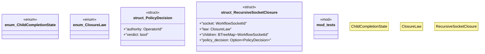

# `crates/praxis-graphlaw/src/chatman/closure.rs`

Source SHA-256: `acb11e29f57ebc5455763454bf3fb191b4823c2aa36a45d42bbc28c445faa402`

## Dependencies

- `crate::shacl::ValidationReport`
- `powl2_decompose::{ParentChildClosure, WorkflowSocketId}`
- `std::collections::{BTreeMap, BTreeSet}`
- `super::abi::{OperatorId, Refusal}`

## Standing

- Structural parse: `ALIVE`
- Runtime behavior: `UNKNOWN`
