# `crates/praxis-graphlaw/src/chatman/compensation.rs`

Source SHA-256: `6b95d125b314c8ea85433b3ddd54dd003c6a0837359e7af61f8dad95383d1c38`

```mermaid
classDiagram
    class struct_PriorActuationRef {
      <<struct>>
      +"prior_receipt_root: Digest"
      +"prior_hook_name: String"
      +"prior_idempotency_key: String"
    }
    class enum_CompensationKind {
      <<enum>>
    }
    class struct_CompensationDispatch {
      <<struct>>
      +"invocation_id: InvocationId"
      +"dispatch_digest: Digest"
      +"seal: CompensationSeal"
    }
    class struct_CompensationSeal {
      <<struct>>
    }
    class struct_CompensationWorkflow {
      <<struct>>
      +"remediates: PriorActuationRef"
      +"kind: CompensationKind"
      +"authority: OperatorId"
      +"admitted_inputs: InputHandles"
      +"expected_consequence: String"
      +"dispatch: CompensationDispatch"
      +"receipt: Receipt"
    }
    class fn_admitted_inputs_digest {
      <<fn>>
    }
    class fn_refuse_if_contains_newline {
      <<fn>>
    }
    class fn_manufacture_compensation_workflow {
      <<fn>>
    }
    class struct_CompensationLedger {
      <<struct>>
      +"entries: Vec~CompensationWorkflow~"
    }
    class mod_tests {
      <<mod>>
    }
    note "CompensationDispatch"
    note "CompensationKind"
    note "CompensationLedger"
    note "CompensationWorkflow"
```

## Dependencies

- `super::abi::{Digest, InputHandles, InvocationId, OperatorId, Receipt, Refusal}`
- `wasm4pm_compat::hash::blake3_combined`

## Standing

- Structural parse: `ALIVE`
- Runtime behavior: `UNKNOWN`
