# `crates/praxis-graphlaw/src/chatman/compensation_test.rs`

Source SHA-256: `7cad2ebdc9fd5af71a8decc070ff8948f0eb3f457bfae2017af156cd3aeda94f`

```mermaid
classDiagram
    class fn_valid_prior_ref {
      <<fn>>
    }
    class fn_valid_inputs {
      <<fn>>
    }
    class fn_valid_kind {
      <<fn>>
    }
    class fn_manufacture_ok {
      <<fn>>
    }
    class fn_all_valid_kinds {
      <<fn>>
    }
    class fn_manufacture_produces_a_verifiable_receipt_carrying_all_declared_elements {
      <<fn>>
    }
    class fn_manufacture_is_deterministic_across_repeated_calls {
      <<fn>>
    }
    class fn_manufacture_digest_changes_when_expected_consequence_changes {
      <<fn>>
    }
    class fn_refuses_empty_authority {
      <<fn>>
    }
    class fn_refuses_empty_admitted_inputs {
      <<fn>>
    }
    class fn_refuses_empty_expected_consequence {
      <<fn>>
    }
    class fn_refuses_missing_prior_receipt_root {
      <<fn>>
    }
    class fn_refuses_missing_prior_hook_name {
      <<fn>>
    }
    class fn_refuses_missing_prior_idempotency_key {
      <<fn>>
    }
    class fn_refuses_a_newline_embedded_in_expected_consequence {
      <<fn>>
    }
    class fn_compensation_kind_name_matches_prd_vocabulary {
      <<fn>>
    }
    class fn_manufacture_accepts_all_seven_compensation_kinds {
      <<fn>>
    }
    class fn_manufacture_digest_differs_across_compensation_kinds {
      <<fn>>
    }
    class fn_compensation_kind_validate_refuses_each_kinds_own_empty_required_field {
      <<fn>>
    }
    class fn_compensation_kind_validate_refuses_a_newline_in_a_kind_specific_field {
      <<fn>>
    }
    class fn_ledger_append_preserves_insertion_order_and_never_shrinks {
      <<fn>>
    }
```

## Dependencies

- `super::*`

## Standing

- Structural parse: `ALIVE`
- Runtime behavior: `UNKNOWN`
