# `crates/praxis-graphlaw/src/chatman/engine.rs`

Source SHA-256: `070a2e0f3328e312c7b3998f5e27652be55129080abe5dc3374c431d00be7dee`

```mermaid
classDiagram
    class struct_AdmissionSpec {
      <<struct>>
      +"constraint_names: Vec~String~"
      +"required_mask: u8"
      +"forbidden_mask: u8"
      +"set_on_admit: u8"
      +"clear_on_admit: u8"
    }
    class struct_EngineProfile {
      <<struct>>
      +"gates: ProfileGates"
      +"symbol_table: ProfileSymbolTable"
      +"admission: AdmissionSpec"
      +"breed_permits: Vec~String~"
    }
    class struct_BoundaryRequest {
      <<struct>>
      +"hook_name: String"
      +"idempotency_key: String"
      +"delta: String"
      +"seal: BoundarySeal"
    }
    class struct_BoundarySeal {
      <<struct>>
    }
    class struct_EngineProcessReceipt {
      <<struct>>
      +"graph_snapshot: Digest"
      +"profile: Digest"
      +"symbol_table: Digest"
      +"projection: Digest"
      +"admission_table: Digest"
      +"route_decision: Digest"
      +"tape: Digest"
      +"hook_event: Digest"
      +"engine_version: Digest"
      +"receipt_root: Digest"
      +"canon_nquads: String"
      +"external_cut: Option~Digest~"
    }
    class type_ProcessReceiptEnvelope {
      <<type>>
    }
    class fn_receipt_root {
      <<fn>>
    }
    class fn_external_cut_digest {
      <<fn>>
    }
    class fn_compile_external_cut_digest {
      <<fn>>
    }
    class struct_AdmittedTransition {
      <<struct>>
      +"envelope: InvocationEnvelope"
      +"receipt: EngineProcessReceipt"
      +"boundary_requests: Vec~BoundaryRequest~"
    }
    class struct_ActuationRecord {
      <<struct>>
      +"post_graph: String"
      +"applied: Vec~(String"
      +"duplicates_skipped: usize"
    }
    class struct_ReplayInputs {
      <<struct>>
      +"envelope: InvocationEnvelope"
      +"snapshot_turtle: String"
      +"profile: EngineProfile"
    }
    class enum_ReplayMismatch {
      <<enum>>
    }
    class struct_StageOutputs {
      <<struct>>
      +"canon_nquads: String"
      +"graph_snapshot: Digest"
      +"profile: Digest"
      +"symbol_table: Digest"
      +"projection: Digest"
      +"admission_table: Digest"
      +"route_decision: RouteDecision"
      +"tape: Digest"
      +"hook_event: Digest"
      +"boundary_requests: Vec~BoundaryRequest~"
      +"stage_seals: [StageSeal; 4]"
    }
    class struct_ChatmanEngine {
      <<struct>>
      +"store: Store"
      +"router: DialectRouter"
      +"profile: EngineProfile"
      +"admission_table: AdmissionTable8"
      +"engine_version: &'static str"
    }
    class fn_merge_pddl_fragments {
      <<fn>>
    }
    class fn_trigger_knowledge_hooks {
      <<fn>>
    }
    class fn_tape_digest {
      <<fn>>
    }
    class fn_atoms_key {
      <<fn>>
    }
    class fn_snapshot_graph {
      <<fn>>
    }
    class fn_refuse_non_ground {
      <<fn>>
    }
    class fn_run_update {
      <<fn>>
    }
    class struct_TraceDoc {
      <<struct>>
      +"run_id: u64"
      +"sealed: bool"
      +"objects: Vec~TraceDocObject~"
      +"events: Vec~TraceDocEvent~"
    }
    class struct_TraceDocObject {
      <<struct>>
      +"id: String"
      +"otype: String"
    }
    class struct_TraceDocEvent {
      <<struct>>
      +"id: String"
      +"activity: String"
      +"op_index: u32"
      +"at_ns: u64"
      +"objects: Vec~String~"
    }
    class struct_BreedWitness {
      <<struct>>
      +"breed: String"
      +"explanation: String"
      +"selected: Option~String~"
    }
    class mod_tests {
      <<mod>>
    }
    class mod_cognition_tests {
      <<mod>>
    }
    note "AdmissionSpec"
    note "AdmittedTransition"
    note "BoundaryRequest"
    note "BreedWitness"
    note "ChatmanEngine"
    note "EngineProcessReceipt"
    note "From~Pddl8Error~ for Refusal"
    note "core::fmt::Debug for ChatmanEngine"
```

## Dependencies

- `bcinr_pddl::error::Pddl8Error`
- `bcinr_pddl::ground::{GroundProblem, GroundTemporalProblem}`
- `bcinr_pddl::parse::{domain_from_pddl, problem_from_pddl}`
- `bcinr_pddl::{Pddl8Domain, Pddl8Problem, Pddl8Tape, TemporalPlan}`
- `bcinr_powl::ocel::{validate_against_tape, ConformanceResult, OcelLog as PowlOcelLog}`
- `bcinr_powl::tape::{OpKind, PowlTape}`
- `bcinr_powl_receipt::causal_receipt::{OcelCausalFrame, OcelCausalReceipt, PackedObjRef}`
- `bcinr_powl_receipt::denial::DenialPolarity`
- `bcinr_powl_receipt::replay::{PowlReplayFrame, PowlReplayVerifier}`
- `crate::TripleStore`
- `crate::hooks::{canonicalize_quads, HookReceipt}`
- `crate::parser::Syntax`
- `crate::shacl::ValidationReport`
- `oxigraph::io::{RdfFormat, RdfParser}`
- `oxigraph::sparql::{QueryResults, SparqlEvaluator}`
- `oxigraph::store::Store`
- `oxrdf::dataset::{CanonicalizationAlgorithm, CanonicalizationHashAlgorithm}`
- `oxrdf::{Dataset, NamedNode, Term}`
- `powl2_decompose::{Powl, WorkflowSocketId}`
- `serde::{Deserialize, Serialize}`
- `super::abi::{Digest, GraphSnapshotId, InvocationEnvelope, Refusal, StageSeal}`
- `super::admission8::{AdmissionTable8, ConstraintMask}`
- `super::closure::RecursiveSocketClosure`
- `super::powl_projection::{ model_declares_external_cut, powl_to_turtle, ExternalCutCompilationOutcome, ExternalCutCompilationRequest, ExternalCutCompiler, }`
- `super::router::{DialectRouter, ProfileGates, QueryShape, RouteDecision}`
- `super::triple8::ProfileSymbolTable`
- `wasm4pm_compat::hash::blake3_combined`
- `wasm4pm_compat::ocel::{EventObjectLink, Object, ObjectChange, ObjectObjectLink, OcelEvent}`

## Standing

- Structural parse: `ALIVE`
- Runtime behavior: `UNKNOWN`
