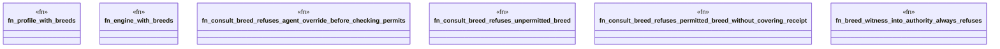

# `crates/praxis-graphlaw/src/chatman/engine_cognition_test.rs`

Source SHA-256: `a728b76f74189f91cc7b46ea32173c60eb8afcfbf1b8149ffd0b8f11ed472a64`

## Dependencies

- `crate::chatman::abi::ProfileId`
- `super::*`

## Standing

- Structural parse: `ALIVE`
- Runtime behavior: `UNKNOWN`
