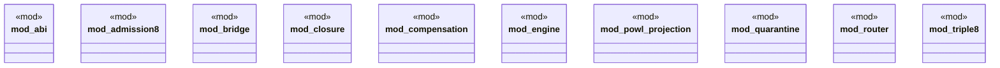

# `crates/praxis-graphlaw/src/chatman/mod.rs`

Source SHA-256: `4e43134629f7bc7acbf59f00411ea72a48a51fa2afeda9f89db7c2306d4758a4`

## Dependencies

- `abi::Refusal`

## Standing

- Structural parse: `ALIVE`
- Runtime behavior: `UNKNOWN`
