# `crates/praxis-graphlaw/src/chatman/powl_projection.rs`

Source SHA-256: `a181f1a5e323fc318e120441fa592525f2e66fdff64fbe182b00a1a6cf142db9`

```mermaid
classDiagram
    class fn_project_pddl_tape_to_powl {
      <<fn>>
    }
    class fn_project_temporal_plan_to_powl {
      <<fn>>
    }
    class fn_project_pddl_tape_to_powl_hierarchical {
      <<fn>>
    }
    class fn_escape_turtle_literal {
      <<fn>>
    }
    class fn_admit_powl_model {
      <<fn>>
    }
    class fn_refusal_from_external_cut {
      <<fn>>
    }
    class fn_resolve_external_cut_at {
      <<fn>>
    }
    class fn_powl_kind_name {
      <<fn>>
    }
    class fn_iri_authority {
      <<fn>>
    }
    class fn_admit_provenance {
      <<fn>>
    }
    class struct_PowlAnnotations {
      <<struct>>
      +"process_invariants: std::collections::BTreeMap~SocketPath"
      +"exogenous_events: std::collections::BTreeMap~SocketPath"
      +"resource_annotations: std::collections::BTreeMap~SocketPath"
      +"guards: std::collections::BTreeMap~(SocketPath"
    }
    class fn_project_pddl31_plan_to_annotated_powl {
      <<fn>>
    }
    class fn_powl_to_turtle {
      <<fn>>
    }
    class fn_annotated_powl_to_turtle {
      <<fn>>
    }
    class fn_emit_powl_node {
      <<fn>>
    }
    class fn_gnode_iri {
      <<fn>>
    }
    class struct_ProjectionRow {
      <<struct>>
      +"element_id: String"
      +"element_type: String"
      +"activity_label: Option~String~"
      +"child_index: Option~String~"
      +"child_model: Option~String~"
      +"precedes_target: Option~String~"
      +"region_id: Option~String~"
      +"sparql_projection: Option~String~"
      +"tera_renderer: Option~String~"
      +"derived_from: Option~String~"
      +"start_node: Option~String~"
      +"end_node: Option~String~"
      +"routing_node: Option~String~"
      +"routing_node_child_index: Option~String~"
      +"edge_id: Option~String~"
      +"edge_source: Option~String~"
      +"edge_target: Option~String~"
      +"process_invariant: Option~String~"
      +"exogenous_event: Option~String~"
      +"resource_annotation: Option~String~"
      +"guard_condition: Option~String~"
    }
    class fn_run_render_model_projection {
      <<fn>>
    }
    class fn_term_string {
      <<fn>>
    }
    class fn_model_declares_external_cut {
      <<fn>>
    }
    class struct_ExternalCutCompilationRequest {
      <<struct>>
      +"region_turtle: &'a str"
      +"root_element_id: &'a str"
      +"workflow_id: &'a str"
      +"title: &'a str"
    }
    class struct_ExternalCutCompilationOutcome {
      <<struct>>
      +"source_powl_digest_hex: String"
      +"sparql_projection_digest_hex: String"
      +"tera_template_digest_hex: String"
      +"arazzo_digest_hex: String"
      +"compiler_version: String"
      +"air_digest_hex: String"
      +"arazzo_document: String"
    }
    class trait_ExternalCutCompiler {
      <<trait>>
      +"compile(
        &self, request: &ExternalCutCompilationRequest~'_~,
    ) -~ Result~ExternalCutCompilationOutcome, Refusal~"
    }
    class mod_tests {
      <<mod>>
    }
```

## Dependencies

- `bcinr_pddl::powl_bridge::{temporal_plan_to_powl_tape, PowlOpSpec}`
- `bcinr_pddl::{Pddl8Tape, TemporalPlan}`
- `oxigraph::io::{RdfFormat, RdfParser}`
- `oxigraph::sparql::{QueryResults, QuerySolution, SparqlEvaluator}`
- `oxigraph::store::Store`
- `oxrdf::Term`
- `powl2_decompose::ChoiceGraph`
- `powl2_decompose::{validate_external_cut, ExternalCutRefusal, GNode, Powl, SocketPath}`
- `super::*`
- `super::abi::Refusal`
- `wasm4pm_compat::pddl::{Pddl31Domain, Pddl31Problem}`

## Standing

- Structural parse: `ALIVE`
- Runtime behavior: `UNKNOWN`
