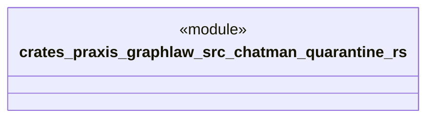

# `crates/praxis-graphlaw/src/chatman/quarantine.rs`

Source SHA-256: `a6ee75272c7beca29b9a2edcc07ac0dd1cea07a9d798838254db9b38fd4e8b22`

## Dependencies

- `super::engine::{AdmittedTransition, EngineProcessReceipt, ReplayInputs}`
- `super::router::{Dialect, DialectRouter}`

## Standing

- Structural parse: `ALIVE`
- Runtime behavior: `UNKNOWN`
