# `crates/praxis-graphlaw/src/chatman/router.rs`

Source SHA-256: `8a30a83b6ce4776718999d5e831b3a48b6042a9e3f73062dd4477f3095cf4ab2`

```mermaid
classDiagram
    class enum_Dialect {
      <<enum>>
    }
    class enum_Route {
      <<enum>>
    }
    class struct_ProfileGates {
      <<struct>>
      +"profile_id: ProfileId"
      +"enabled_dialects_mask: u8"
      +"actuation_dialects_mask: u8"
      +"max_hot_constraints: u8"
    }
    class struct_QueryShape {
      <<struct>>
      +"constraint_count: u8"
      +"requires_construct: bool"
      +"requires_owl: bool"
      +"requires_n3_builtins: bool"
      +"wants_actuation: bool"
    }
    class struct_RouteDecision {
      <<struct>>
      +"dialect: Dialect"
      +"route: Route"
      +"profile_hash: Digest"
      +"decision_hash: Digest"
    }
    class struct_DialectRouter {
      <<struct>>
      +"gates: ProfileGates"
    }
    class struct_N3Ticks {
      <<struct>>
    }
    class struct_N3CostBound {
      <<struct>>
      +"limit: N3Ticks"
      +"used: N3Ticks"
    }
    class enum_N3Builtin {
      <<enum>>
    }
    class enum_N3ActuationBuiltin {
      <<enum>>
    }
    class struct_N3ExecutionProfile {
      <<struct>>
      +"builtin_whitelist_mask: u8"
      +"cost_bound_ticks: N3Ticks"
    }
    class struct_N3Rule {
      <<struct>>
      +"rule_id: String"
      +"builtins: Vec~N3Builtin~"
      +"declared_cost: N3Ticks"
      +"direct_actuation_builtins: Vec~N3ActuationBuiltin~"
    }
    class struct_N3ExecutionReceipt {
      <<struct>>
      +"rules_admitted: Vec~String~"
      +"ticks_used: N3Ticks"
      +"execution_hash: Digest"
    }
    class struct_N3Executor {
      <<struct>>
      +"gates: &'a ProfileGates"
      +"execution: &'a N3ExecutionProfile"
    }
    class mod_tests {
      <<mod>>
    }
    note "Dialect"
    note "DialectRouter"
    note "N3ActuationBuiltin"
    note "N3Builtin"
    note "N3CostBound"
    note "N3ExecutionProfile"
    note "N3Executor~"
    note "ProfileGates"
    note "QueryShape"
    note "Route"
```

## Dependencies

- `serde::{Deserialize, Serialize}`
- `super::abi::{Digest, ProfileId, Refusal}`
- `wasm4pm_compat::hash::blake3_combined`

## Standing

- Structural parse: `ALIVE`
- Runtime behavior: `UNKNOWN`
