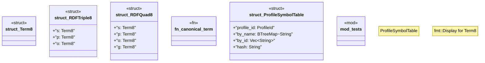

# `crates/praxis-graphlaw/src/chatman/triple8.rs`

Source SHA-256: `e202420efde2ea412bb1def72c9e074f1d39f7df16fb4877e98a90d542f54b09`

## Dependencies

- `chicago_tdd_tools::prelude::*`
- `oxrdf::{Literal, NamedNode, Quad, Triple}`
- `oxrdf::{QuadRef, TermRef, TripleRef}`
- `serde::{Deserialize, Serialize}`
- `std::collections::BTreeMap`
- `std::fmt`
- `super::*`
- `super::abi::{GraphSnapshotId, ProfileId, Refusal}`
- `wasm4pm_compat::hash::{blake3_combined, blake3_hex}`

## Standing

- Structural parse: `ALIVE`
- Runtime behavior: `UNKNOWN`
