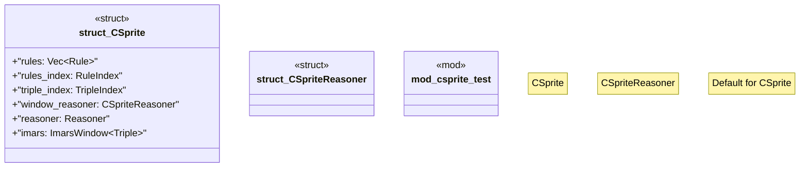

# `crates/praxis-graphlaw/src/csprite.rs`

Source SHA-256: `1639b89c6ec1a73dba0cae5d4d8f4a03433929e8c8cd183a3d5497c6a1102ab4`

## Dependencies

- `crate::fastmap::FxHashSet`
- `crate::imars_window::ImarsWindow`
- `crate::{ BackwardChainer, Binding, Encoder, QueryEngine, Reasoner, Rule, RuleIndex, SimpleQueryEngine, Triple, TripleIndex, TripleStore, VarOrTerm, }`
- `log::trace`
- `std::collections::HashMap`
- `std::fmt::Write`
- `std::rc::Rc`
- `std::sync::Arc`

## Standing

- Structural parse: `ALIVE`
- Runtime behavior: `UNKNOWN`
