# `crates/praxis-graphlaw/src/csprite_test.rs`

Source SHA-256: `42523d687bc377b3de399ce650d44e3a8d261b05de8c89a8c0b2b57c133a048e`

```mermaid
classDiagram
    class fn_test_sprite_compute {
      <<fn>>
    }
    class fn_test_sprite_compute_hierarchy {
      <<fn>>
    }
    class fn_test_rewrite_hierarchy_csprite {
      <<fn>>
    }
    class fn_test_csprite_cycles_terminate {
      <<fn>>
    }
    class fn_test_reconstruct_triples_from_bindings_skips_negated_literal_with_unbound_variable {
      <<fn>>
    }
    class fn_test_materialize_window_does_not_panic_on_negated_body_literal_with_unbound_variable {
      <<fn>>
    }
```

## Dependencies

- `crate::csprite::{CSprite, CSpriteReasoner}`
- `crate::{ Binding, BodyLiteral, Parser, QueryEngine, Rule, SimpleQueryEngine, Triple, VarOrTerm, }`
- `std::rc::Rc`
- `std::sync::Arc`

## Standing

- Structural parse: `ALIVE`
- Runtime behavior: `UNKNOWN`
