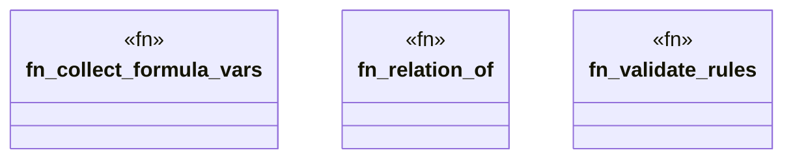

# `crates/praxis-graphlaw/src/datalog.rs`

Source SHA-256: `6862595a3f4dd6d2558aa3abe7cd2ed042307a01e455cb51c578cd139bf74b11`

## Dependencies

- `crate::encoding::Encoder`
- `crate::triples::{Aggregate, Rule, Triple, VarOrTerm}`
- `std::collections::{HashMap, HashSet}`

## Standing

- Structural parse: `ALIVE`
- Runtime behavior: `UNKNOWN`
