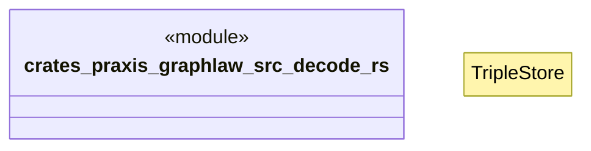

# `crates/praxis-graphlaw/src/decode.rs`

Source SHA-256: `586cbb83c5ca6fd094b9771decbc2a3210a9bca00184007361185d4d1d69c2dc`

## Dependencies

- `crate::TripleStore`
- `crate::bindings::Binding`
- `crate::encoding::Encoder`
- `crate::rule::Rule`
- `crate::term::Triple`
- `std::fmt::Write`

## Standing

- Structural parse: `ALIVE`
- Runtime behavior: `UNKNOWN`
