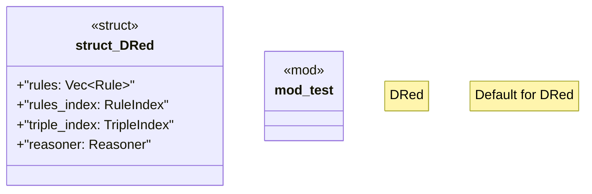

# `crates/praxis-graphlaw/src/dred.rs`

Source SHA-256: `e0b8809321a91c1d73e93b25ac17845f1d1173004f919fbc31759163e2fa9178`

## Dependencies

- `crate::dred::DRed`
- `crate::utils::Utils`
- `crate::{ Binding, QueryEngine, Reasoner, Rule, RuleIndex, SimpleQueryEngine, Triple, TripleIndex, TripleStore, VarOrTerm, }`
- `crate::{Triple, VarOrTerm}`
- `log::trace`
- `std::collections::HashMap`
- `std::rc::Rc`
- `std::sync::Arc`

## Standing

- Structural parse: `ALIVE`
- Runtime behavior: `UNKNOWN`
