# `crates/praxis-graphlaw/src/encoding.rs`

Source SHA-256: `3b99f114a37f78c4e31c32a09892096d1ff70e22322c2c930ae3e38ae5c09931`

```mermaid
classDiagram
    class enum_EncodedValue {
      <<enum>>
    }
    class struct_InternalEncoder {
      <<struct>>
      +"encoded: FxHashMap~EncodedValue"
      +"decoded: FxHashMap~usize"
      +"counter: usize"
    }
    class fn_get {
      <<fn>>
    }
    class fn_decode {
      <<fn>>
    }
    class fn_decode_to_term {
      <<fn>>
    }
    class struct_Encoder {
      <<struct>>
    }
    class fn_recover {
      <<fn>>
    }
    class fn_encoder_recovers_from_lock_poisoning {
      <<fn>>
    }
    class fn_test_encoding {
      <<fn>>
    }
    class fn_test_encoder_literal_vs_iri_distinct {
      <<fn>>
    }
    class fn_test_literal_datatype_and_langtag_preserved {
      <<fn>>
    }
    note "Default for InternalEncoder"
    note "Encoder"
    note "InternalEncoder"
```

## Dependencies

- `crate::{fastmap::FxHashMap, BlankNodeImpl, LiteralImpl, Term, TermImpl}`
- `once_cell::sync::Lazy`
- `std::sync::Mutex`

## Standing

- Structural parse: `ALIVE`
- Runtime behavior: `UNKNOWN`
