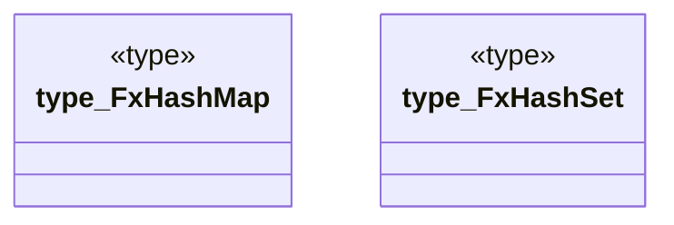

# `crates/praxis-graphlaw/src/fastmap.rs`

Source SHA-256: `ddcf3680ebf076b55a39953d90fd811d78d44af79d66dbf27f84afbda00e18bb`

## Dependencies

- None observed.

## Standing

- Structural parse: `ALIVE`
- Runtime behavior: `UNKNOWN`
