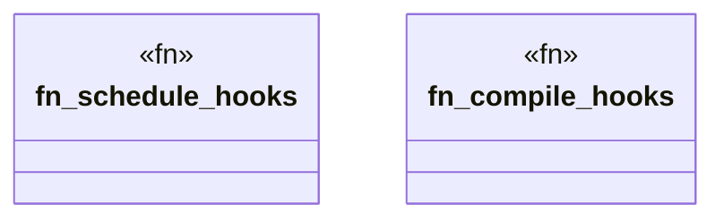

# `crates/praxis-graphlaw/src/hooks/compile.rs`

Source SHA-256: `f90a6455f76d106b7986935aadc636be802154dc11789e35c45d85a36362d8aa`

## Dependencies

- `crate::fastmap::FxHashMap`
- `super::{CompiledHook, HookId, KnowledgeHook}`

## Standing

- Structural parse: `ALIVE`
- Runtime behavior: `UNKNOWN`
