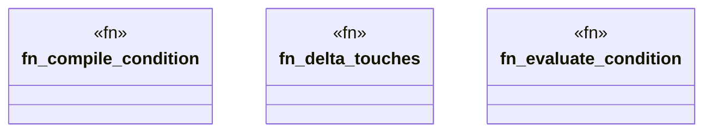

# `crates/praxis-graphlaw/src/hooks/condition.rs`

Source SHA-256: `ae9fd670bde86175c1bcb898e144e832bbc3d9ece297897122aae6f3c129c17b`

## Dependencies

- `crate::TripleStore`
- `crate::encoding::Encoder`
- `super::datalog::translate_datalog_to_n3`
- `super::delta_query::{count_pred_in_delta, count_pred_in_store, parse_shape_map}`
- `super::parsing::clean_term`
- `super::{ CmpOp, CompiledCondition, DiagnosticDetail, GraphDelta, HookCondition, TriggerDiagnostic, }`

## Standing

- Structural parse: `ALIVE`
- Runtime behavior: `UNKNOWN`
