# `crates/praxis-graphlaw/src/hooks/construct.rs`

Source SHA-256: `fe428411522073494626435031e277857b27d42fc320086a906cf10c91b6c515`

```mermaid
classDiagram
    class struct_HookReceipt {
      <<struct>>
      +"hook_name: String"
      +"delta_hash: String"
      +"idempotency_key: String"
      +"delta_quads: String"
    }
    class fn_collect_triple_patterns {
      <<fn>>
    }
    class struct_RowBlankNodeContext {
      <<struct>>
      +"query_str: &'a str"
      +"row_key: &'a str"
      +"minted: BTreeMap~String"
    }
    class fn_canonical_row_key {
      <<fn>>
    }
    class fn_mint_or_reuse_construct_blank_node {
      <<fn>>
    }
    class fn_instantiate_term_pattern {
      <<fn>>
    }
    class fn_instantiate_named_node_pattern {
      <<fn>>
    }
    class fn_instantiate_triple_pattern {
      <<fn>>
    }
    class fn_evaluate_construct {
      <<fn>>
    }
    class fn_serialize_delta_quad {
      <<fn>>
    }
```

## Dependencies

- `crate::encoding::Encoder`
- `crate::registry::{CONSTRUCT_BNODE_INTERN, SYNTHETIC_COUNTER}`
- `crate::sparql::Binding`
- `crate::term::Triple`
- `crate::tripleindex::TripleIndex`
- `serde::{Deserialize, Serialize}`
- `spargebra::SparqlParser`
- `spargebra::term::{NamedNodePattern, TermPattern}`
- `std::collections::BTreeMap`
- `std::sync::atomic::Ordering`

## Standing

- Structural parse: `ALIVE`
- Runtime behavior: `UNKNOWN`
