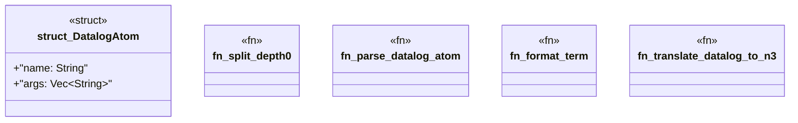

# `crates/praxis-graphlaw/src/hooks/datalog.rs`

Source SHA-256: `54f7a4e17a6397db969a3ceb346f1b362d1e3f0e2c7cd08fdc38f53b7e792d6e`

## Dependencies

- None observed.

## Standing

- Structural parse: `ALIVE`
- Runtime behavior: `UNKNOWN`
