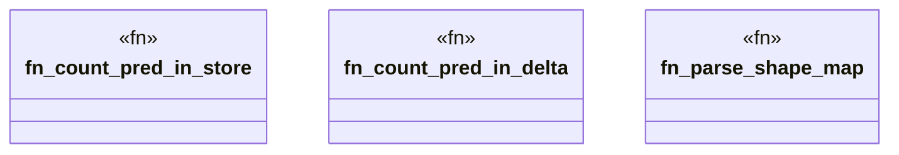

# `crates/praxis-graphlaw/src/hooks/delta_query.rs`

Source SHA-256: `91cbcc951ef986c7836d74be0010bd2079e31f9ae9034beed5722d1affa8a072`

## Dependencies

- `crate::TripleStore`
- `crate::encoding::Encoder`
- `super::GraphDelta`
- `super::parsing::clean_term`

## Standing

- Structural parse: `ALIVE`
- Runtime behavior: `UNKNOWN`
