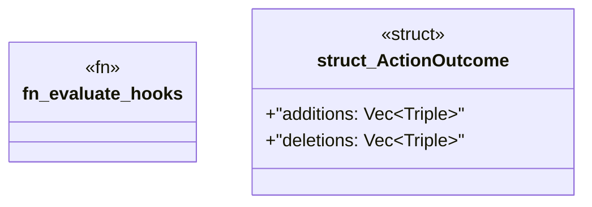

# `crates/praxis-graphlaw/src/hooks/evaluate.rs`

Source SHA-256: `a41da577648fae3c3b5fbf81399d95502c8f9cef0a81f7500fc48f0355d481b8`

## Dependencies

- `crate::TripleStore`
- `crate::term::Triple`
- `serde::{Deserialize, Serialize}`
- `super::condition::evaluate_condition`
- `super::{CompiledHook, GraphDelta, HookVerdict, HookVerdictRecord}`

## Standing

- Structural parse: `ALIVE`
- Runtime behavior: `UNKNOWN`
